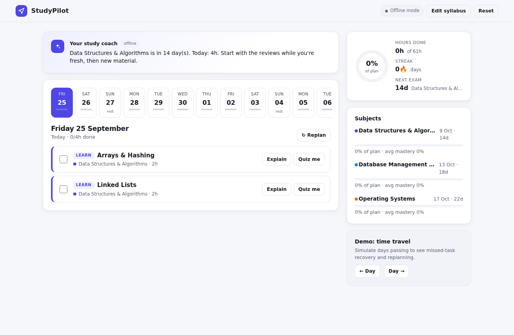
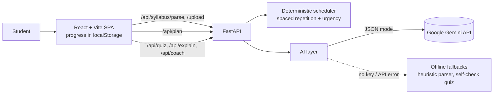

# StudyPilot: AI Study Planner That Adapts to You

> Paste your syllabus. Get a day-by-day exam plan with spaced repetition, AI quizzes and a tutor, and a plan that re-balances itself when you fall behind or struggle with a topic.

**Theme:** AI with Education · **Stack:** FastAPI · React (Vite) · Google Gemini · Docker

**Live demo:** `<add your Render URL>` · **Demo video:** `<add your video link>`



---

## The problem

Every semester, college students face the same issues before exams:

- A syllabus PDF with 40+ topics across 5–6 subjects, and exams packed into two weeks.
- No idea how long each topic will take, so they plan badly or don't plan at all.
- They learn a topic once and forget it by exam day (the forgetting curve).
- One missed day breaks the whole timetable, so they give up on it.
- Generic planners and to-do apps know nothing about their syllabus or what they actually understand.

## What StudyPilot does

| Step | What happens | Where AI is used |
|---|---|---|
| **1. Understand the syllabus** | Paste text or upload a PDF, in any messy format. Subjects, topics and exam dates are extracted. | Gemini splits units into study-sized topics and estimates **difficulty (1–3)** and **hours** per topic |
| **2. Build the plan** | A day-by-day calendar that respects your daily hours and rest days | Deterministic scheduler (below). Reliable, explainable, instant |
| **3. Learn** | Each task has **Explain** (AI tutor with follow-up questions) and **Quiz me** | Gemini writes explanations and MCQs **pitched at your current mastery** |
| **4. Adapt** | Quiz scores update per-topic mastery. **Replan** rebuilds the future around what you actually know and what you missed | Mastery feeds back into the scheduler: weak topics get extra reviews, known topics get skipped |
| **5. Stay on track** | Progress ring, streaks, per-subject progress, exam countdowns, missed-task recovery | Gemini "study coach" gives a short, personalised focus for the day |

### Why a hybrid design (LLM + algorithm)?
LLMs are good at *understanding* unstructured syllabi and generating teaching content. They are bad at arithmetic-heavy constraint satisfaction, where a hallucinated calendar is worse than no calendar. So StudyPilot uses **Gemini for understanding and content**, and a **tested, deterministic scheduler** for the timetable. Every plan is guaranteed to respect your hours, rest days and exam dates. If something can't fit, the app tells you instead of silently dropping it.

## The scheduler (`backend/app/scheduler.py`)

- **Urgency-based interleaving:** every 30–60 min block goes to the subject with the highest *remaining hours ÷ study days left before its exam*. Nearer exams get priority, and subjects are mixed instead of crammed one after another.
- **Spaced repetition:** after a topic is learned, 30-min reviews are scheduled at **+1, +3, +7 (+14) days**. Hard topics and topics you scored badly on get more.
- **Final revision block** on the last study day before each exam (moves earlier if that day is a rest day).
- **Lighter exam days**, **rest days**, and a capacity check with clear warnings when the syllabus doesn't fit.
- **Adaptive replanning:** completed hours and quiz mastery are fed back in. `learning_hours = hours × (1 − 0.6 × mastery) − completed`. Topics ≥ 85% mastery skip learning and keep one light review.
- Stable task IDs, so progress survives replans.

## Architecture



- **Stateless backend:** all student data stays in the browser (privacy-friendly, no login, free hosting).
- **Graceful degradation:** without a Gemini key, or if the API fails or hits quota, the app still works: a heuristic syllabus parser, self-assessment quizzes and a rule-based coach take over. The header badge shows which mode is active.
- **Safety:** AI output is schema-validated and clamped server-side. Tutor markdown is sanitised with DOMPurify before rendering.

## Run locally

**Prerequisites:** Python 3.11+, Node 20+, and a free Gemini API key from <https://aistudio.google.com/apikey>. The key is optional, but you need it for the AI features.

```bash
# 1) backend
cd backend
python -m venv .venv && source .venv/bin/activate    # Windows: .venv\Scripts\activate
pip install -r requirements.txt
export GEMINI_API_KEY=your_key_here                   # Windows: set GEMINI_API_KEY=...
uvicorn app.main:app --reload --port 8000

# 2) frontend (new terminal)
cd frontend
npm install
npm run dev          # http://localhost:5173 (proxies /api to :8000)
```

Or run everything in one container:

```bash
docker build -t studypilot .
docker run -p 8000:8000 -e GEMINI_API_KEY=your_key_here studypilot   # http://localhost:8000
```

## Deploy (free)

**Render (one service, recommended).** Push this repo to GitHub, then on Render choose **New + → Blueprint**, pick the repo, and paste your `GEMINI_API_KEY` when asked. `render.yaml` builds the Dockerfile, which serves both the API and the React build. Free instances sleep when idle, so open the link a minute before judging or recording.

**Split hosting (optional).** Backend on Render/Railway, frontend on Vercel: set the Vercel root to `frontend`, add `VITE_API_URL=https://your-api.onrender.com`, and set `ALLOWED_ORIGINS=https://your-app.vercel.app` on the backend.

## Tests

```bash
cd backend && pytest -q     # 21 tests: scheduler invariants, parser, API, AI-path sanitising & fallbacks
```

CI runs backend tests and the frontend build on every push (`.github/workflows/ci.yml`).

## API

| Method | Path | Purpose |
|---|---|---|
| GET | `/api/health` | Status + whether Gemini is configured |
| POST | `/api/syllabus/parse` | `{text}` → subjects/topics (AI or heuristic) |
| POST | `/api/syllabus/upload` | PDF/TXT upload → subjects/topics |
| POST | `/api/plan` | Subjects, exam dates, hours/day, rest days, mastery, progress → full plan |
| POST | `/api/quiz` | Adaptive MCQs for a topic at the student's level |
| POST | `/api/explain` | Tutor explanation / follow-up answer (markdown) |
| POST | `/api/coach` | Personalised daily coaching message |

Interactive docs at `/docs` when the server is running.

## Project structure

```
backend/
  app/main.py          FastAPI routes, PDF upload, serves the built SPA
  app/scheduler.py     plan generation (spaced repetition, urgency interleaving)
  app/ai_features.py   Gemini prompts, output validation, offline fallbacks
  app/llm.py           minimal Gemini REST client (JSON mode)
  tests/               pytest suite
frontend/
  src/components/      Setup, Dashboard, QuizModal, TutorDrawer
  src/lib/progress.js  mastery model, replan request building, stats
Dockerfile, render.yaml
```

## Roadmap (Round 2 ideas)

- Google Calendar export and daily reminders (WhatsApp / email)
- Previous-year-question (PYQ) upload, with topics weighted by how often they appear in exams
- Hindi and regional-language tutor mode, plus text-to-speech for accessibility
- Pomodoro timer that logs real study time
- Accounts and sync across devices; study groups with a shared plan and a leaderboard
- Scanned-PDF OCR for syllabus upload

## Team

- Manpreet, ABV-IIITM Gwalior

## License

MIT
